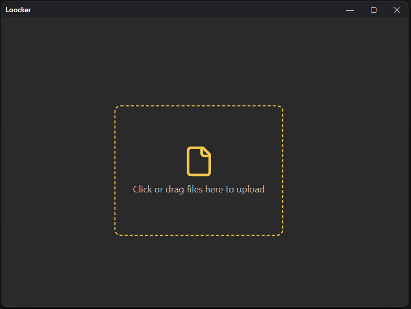

# Loocker 🔐

A desktop application for encrypting and decrypting files with multiple encryption algorithms and customizable encryption recipes. Built with Electron and React, Loocker provides a modern, intuitive interface for secure file protection.

## 🖼️ Screenshots

### Main Interface - File Selection & Recipe Configuration

*Intuitive drag-and-drop interface for file selection and recipe configuration*

### Encryption Process

*Step-by-step encryption with multiple algorithm layers*

### RSA Key Generation

*Built-in RSA key pair generator with PEM export capabilities*

## ✨ Features

### 🔒 Encryption Algorithms
- **AES-256-GCM**: Industry-standard symmetric encryption with authenticated encryption
- **RSA-OAEP**: Asymmetric encryption with SHA-256 hashing for secure key exchange
- **Multiple Key Sources**: Support for passphrases and key files

### 🧪 Recipe System
Create custom encryption recipes with multiple layers of protection:
- **Sequential Encryption**: Chain multiple encryption algorithms in any order
- **Mixed Algorithms**: Combine symmetric and asymmetric encryption in a single recipe
- **Drag & Drop**: Easily reorder encryption steps with intuitive drag-and-drop interface
- **Visual Configuration**: Step-by-step recipe builder with clear algorithm selection

### 🎯 Key Management
- **RSA Key Generation**: Built-in RSA key pair generator with configurable key sizes (2048-bit default)
- **PEM Format Support**: Import/export keys in standard PEM format
- **Key File Support**: Use existing key files for encryption operations
- **Passphrase Support**: Simple passphrase-based encryption for quick operations

### 📁 File Operations
- **Batch Processing**: Encrypt or decrypt multiple files simultaneously
- **File Selection**: Drag-and-drop file selection with support for any file type
- **Automatic Naming**: Encrypted files automatically get `.enc` extension
- **Local Export**: Save encrypted/decrypted files to any local directory

### 🎨 User Interface
- **Modern Design**: Clean, responsive interface built with Tailwind CSS
- **Dark/Light Theme**: Adaptive theming with DaisyUI components
- **Smooth Animations**: Fluid transitions and micro-interactions
- **Cross-Platform**: Native desktop experience on Windows, macOS, and Linux

## 🚀 Getting Started

### Prerequisites
- **Node.js**: Version 22 or higher (tested with Node.js 24)
- **npm**: Package manager (comes with Node.js)

### Installation

1. **Clone the repository**
   ```bash
   git clone <repository-url>
   cd Loocker
   ```

2. **Install dependencies**
   ```bash
   npm install
   ```

3. **Start the application**
   ```bash
   npm start
   ```

### Building for Production

Build for your platform:
```bash
# Build for current platform
npm run make

# Build for specific platforms
npm run make:linux
npm run make:windows
npm run make:macos
```

## 📖 Usage Guide

### Basic Encryption
1. **Select Files**: Drag and drop files or click to browse
2. **Configure Recipe**: Add encryption steps using the recipe builder
3. **Set Keys**: Provide passphrases or import key files
4. **Encrypt**: Click "Encrypt files" and choose save location

### Creating Encryption Recipes
1. **Add Steps**: Click the "+" button to add encryption layers
2. **Choose Algorithm**: Select from AES-256-GCM or RSA-OAEP
3. **Configure Keys**: Set up passphrases or import key files
4. **Reorder Steps**: Drag steps to change encryption order
5. **Save Recipe**: Your recipe is automatically saved for the session

### RSA Key Generation
1. **Open Key Generator**: Click "Generate Keys" in the RSA step configuration
2. **Choose Key Size**: Select 2048-bit (recommended) or 4096-bit
3. **Generate**: Click "Generate Key Pair"
4. **Export Keys**: Copy to clipboard or save as PEM files

### Decryption
1. **Select Encrypted Files**: Choose `.enc` files to decrypt
2. **Configure Recipe**: Set up the same recipe used for encryption
3. **Provide Keys**: Enter the same keys used during encryption
4. **Decrypt**: Click "Decrypt files" and choose save location

## 🔧 Technical Details

### Architecture
- **Frontend**: React 19 with TypeScript
- **Desktop Framework**: Electron with Electron Forge
- **Styling**: Tailwind CSS with DaisyUI components
- **Build Tool**: Vite for fast development and building
- **Encryption**: Web Crypto API for secure, standards-compliant encryption

### Security Features
- **Authenticated Encryption**: AES-GCM provides both confidentiality and authenticity
- **Secure Key Derivation**: Proper key padding and validation
- **Random IVs**: Cryptographically secure random initialization vectors
- **Memory Safety**: Keys are properly managed and cleared from memory
- **No Network**: All operations happen locally - no data leaves your machine

### Supported File Types
- **Any File Type**: Loocker works with any file format
- **Large Files**: Efficient streaming for large file encryption
- **Binary Files**: Full support for binary data encryption

## 🛠️ Development

### Project Structure
```
src/
├── components/          # React components
│   ├── recipe/         # Recipe configuration components
│   ├── fileselector/   # File selection components
│   └── ...
├── objects/
│   └── algorithms/     # Encryption algorithm implementations
├── pages/              # Main application pages
└── main.ts            # Electron main process
```

### Available Scripts
- `npm start` - Start development server
- `npm run make` - Build for production
- `npm run lint` - Run ESLint
- `npm test` - Run tests with Playwright

## 📋 Requirements
- **Node.js**: Version 22 or higher (tested under Node.js 24)
- **Operating System**: Windows 10+, macOS 10.15+, or Linux (Ubuntu 18.04+)
- **Memory**: 4GB RAM minimum, 8GB recommended
- **Storage**: 100MB for application, additional space for encrypted files

## 🤝 Contributing

Contributions are welcome! Please feel free to submit a Pull Request. For major changes, please open an issue first to discuss what you would like to change.

## 📄 License

This project is licensed under the MIT License - see the [LICENSE](LICENSE) file for details.

## ⚠️ Security Notice

- Always keep your encryption keys secure and backed up
- Test decryption with a small file before encrypting important data
- This software is provided as-is for educational and personal use
- For critical security applications, consider additional security audits

---

**Made with ❤️ by Mathis²**